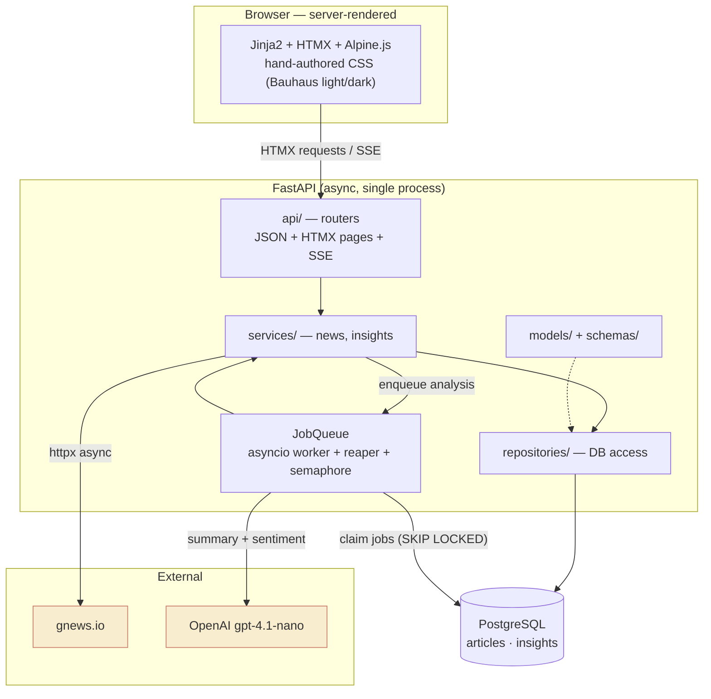
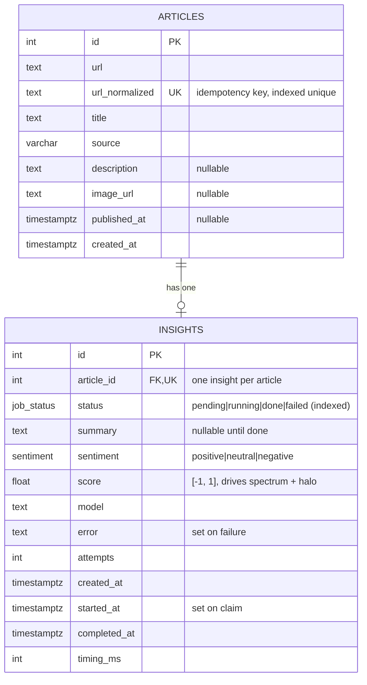
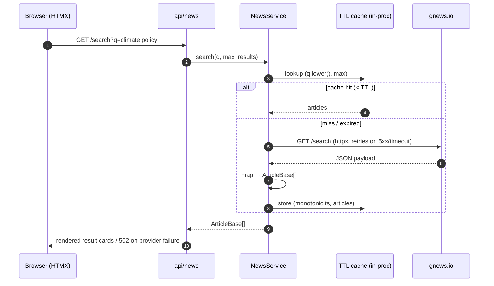
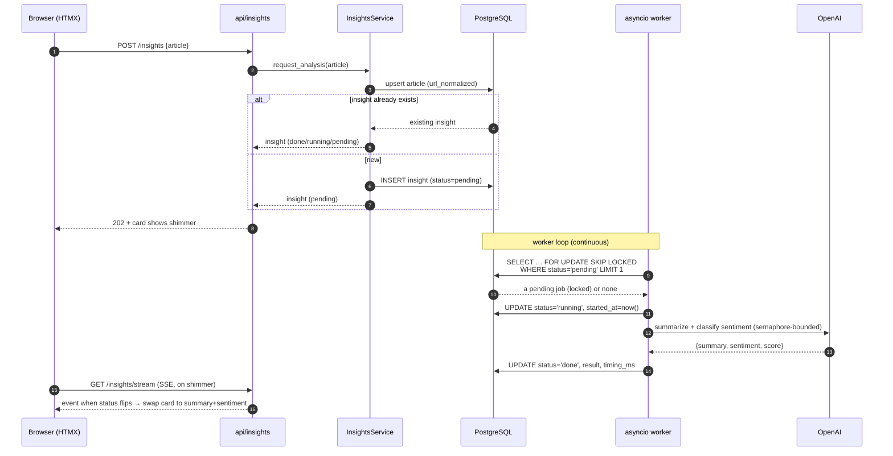
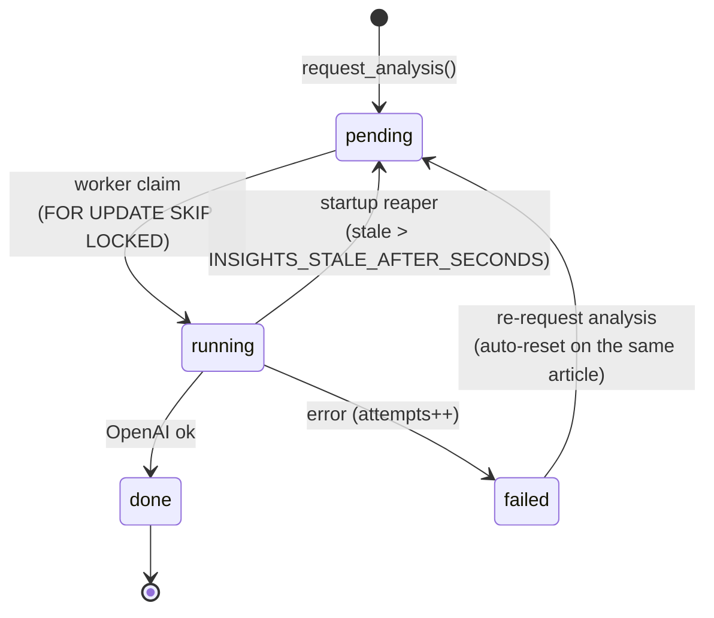

# Architecture

Aries News searches real-time headlines (gnews.io), generates an AI **summary +
sentiment** for an article on demand (OpenAI `gpt-4.1-nano`), stores the result
in PostgreSQL, and lets you browse everything on an **AI Insights** page.

The defining constraint: this codebase is the venue for a follow-up **no-AI live
coding session**, so the design favours a small, all-Python surface that a human
can extend by hand — server-rendered templates over a SPA, an in-process async
worker over a separate queue tier. Where that simplicity has a cost, it is
written down (see [Failure modes & limitations](#failure-modes--limitations))
rather than hidden.

---

## 1. System overview



| Concern | Choice |
| --- | --- |
| Language / runtime | Python 3.12, asyncio throughout |
| Web framework | FastAPI (async-native) |
| Persistence | PostgreSQL via SQLAlchemy 2.0 async + asyncpg |
| Migrations | Alembic (async env) |
| Config | pydantic-settings (`.env`) |
| HTTP client | httpx `AsyncClient` (+ tenacity retries) |
| AI | OpenAI SDK, model `gpt-4.1-nano` |
| Background work | in-process `asyncio` worker + DB-backed job rows |
| UI streaming | Server-Sent Events (`sse-starlette`) |
| Frontend | Jinja2 + HTMX + Alpine.js + hand-authored CSS (Bauhaus light/dark theme) |

The rationale and the alternatives weighed are recorded in
[`docs/adr/0001-stack-and-async.md`](docs/adr/0001-stack-and-async.md).

---

## 2. Layering

Strict one-directional dependencies: an outer layer may call inward, never the
reverse.

```
            ┌──────────────────────────────────────────────┐
 inbound →  │  api/        routers: JSON, HTMX pages, SSE   │
            ├──────────────────────────────────────────────┤
            │  services/   news (gnews), insights (OpenAI,  │
            │              JobQueue orchestration)          │
            ├──────────────────────────────────────────────┤
            │  repositories/   transactional DB access      │
            ├──────────────────────────────────────────────┤
            │  models/ (SQLAlchemy)  +  schemas/ (Pydantic) │
            └──────────────────────────────────────────────┘
              core/  cross-cutting: config, db engine,
                     enums, url normalization
```

- **`api/`** — thin HTTP boundary. Validates input, maps service errors to
  status codes, renders templates / streams SSE. Holds no business logic.
  *(e.g. `api/news.py` — `GET /api/news/search`.)*
- **`services/`** — the business logic. `news.py` owns the gnews client, the TTL
  cache, and retry policy; `insights.py` (insights phase) owns idempotency and
  drives the `JobQueue`.
- **`repositories/`** — all DB reads/writes, including the transactional job
  claim. Keeps SQL out of services.
- **`models/`** — SQLAlchemy ORM tables (`Article`, `Insight`).
- **`schemas/`** — Pydantic v2 contracts at the API and provider boundaries
  (`ArticleBase`/`ArticleRead`, `AnalysisResult`/`InsightRead`).
- **`core/`** — cross-cutting primitives importable by any layer: `config.py`
  (settings singleton), `db.py` (async engine, `Base`, session factory),
  `enums.py` (`JobStatus`, `Sentiment`), `url.py` (URL normalization).

**Service lifetime & injection.** `NewsService`, the `JobQueue`, and
`InsightsService` (constructed with that queue) are created once in the
`main.py` lifespan and stored on `app.state`. Routers never import a service
instance directly; they receive it through the getters in `dependencies.py`
(`get_news_service` / `get_insights_service`, which read `request.app.state` and
raise a clear error if the lifespan never populated it) via `Depends`. This
gives one process-wide instance per service — reused across JSON, HTMX, and SSE
routes — and a single override seam for tests (`app.dependency_overrides`). The
lifespan starts the queue's worker on boot and stops it on shutdown; because the
`InsightsService` holds the *same* queue object, the worker publishes to exactly
the registry the SSE endpoints subscribe on. See
[ADR-0002](docs/adr/0002-app-state-services.md).

---

## 3. Data model

Two tables, one-to-one. An article is the identity; an insight is its single AI
analysis (job state + result fused on one row).



Key points:

- **Idempotency lives in the schema.** `articles.url_normalized` carries a
  `UNIQUE` index. `core/url.normalize_url` lower-cases scheme/host, drops a
  leading `www.`, removes default ports, strips tracking params
  (`utm_*`, `fbclid`, `gclid`, …), sorts the rest, and drops the fragment — so
  the same article reached via different tracking links collapses to one row.
  The function is pure and idempotent: `normalize_url(normalize_url(x)) ==
  normalize_url(x)`.
- **One insight per article** is enforced twice over: `insights.article_id` is
  both a foreign key (`ON DELETE CASCADE`) and `UNIQUE`. Even under a race, the
  database refuses a duplicate; the service treats a conflict as "return the
  existing insight."
- `JobStatus` and `Sentiment` are `StrEnum`s persisted as native Postgres enum
  types (`job_status`, `sentiment`) — see `core/enums.py`. `score` is a
  continuous value in `[-1, 1]` that the UI maps to the spectrum-bar marker and
  the card halo colour.
- Constraint/index names are pinned by a naming convention in `core/db.py`,
  keeping Alembic autogenerate diffs stable. The baseline migration
  (`0001_baseline`) is hand-authored to match.

---

## 4. Request flow — search

Search is synchronous and read-only. No job, no AI; just the news provider plus
a short-TTL cache that protects the gnews free tier (100 requests/day).



Notes:
- Retries are transient-only (transport errors + `5xx`) via tenacity, with
  exponential backoff; non-transient failures surface immediately as
  `NewsServiceError` → HTTP `502`.
- The cache key is `(query.strip().lower(), max_results)` and entries expire
  after `news_cache_ttl_seconds` (default 300s), measured on a monotonic clock.

---

## 5. Job lifecycle — analyze an article

Requesting analysis is asynchronous. The endpoint returns immediately with a
job; the worker does the OpenAI call out of band; the browser learns of
completion over SSE.



### State machine



### Why each piece exists

- **Transactional claim (`SELECT … FOR UPDATE SKIP LOCKED`).** Selecting the
  next `pending` row and flipping it to `running` in one transaction guarantees
  no two workers — within a process or across processes — grab the same job.
  `SKIP LOCKED` lets a second worker step over a locked row instead of blocking,
  so concurrent workers fan out across distinct jobs.
- **Semaphore.** An `asyncio.Semaphore(insights_max_concurrency)` (default 4)
  caps simultaneous OpenAI calls, bounding cost and rate-limit exposure while
  still overlapping latency-bound requests.
- **Startup reaper.** A job left `running` (process killed mid-call) would
  otherwise hang forever. On startup the reaper re-queues every insight stuck in
  `running` longer than `insights_stale_after_seconds` (default 120) back to
  `pending`, so a deploy restart self-heals. Re-requesting a `failed` article
  auto-resets it to `pending` (a retry); `attempts` records how many times a job
  has been claimed, for observability.
- **DB-backed state.** Job state lives in Postgres, not process memory, so it
  survives a restart and is observable with plain SQL.

---

## 6. The SSE update path

The browser keeps browsing while analysis runs. When a card is requested, HTMX
opens an SSE connection; the server subscribes to the insight via an **in-memory
pub/sub** — the worker pushes each status change onto per-insight
`asyncio.Queue` subscribers (`JobQueue._publish`), and the stream yields one
event per change until the insight is terminal. HTMX swaps the shimmer
placeholder for the rendered summary + sentiment.

```
shimmer card  ──HTMX──▶  GET /api/insights/{id}/stream
                              │  (sse-starlette EventSourceResponse)
                              │  subscribe() → per-insight asyncio.Queue
   worker publishes running ──▶  event (card stays in shimmer)
   worker publishes done/failed ─▶  event → HTMX swaps card to result
```

Delivery is push-based, not a DB poll: subscribers only ever receive events the
worker pushes in-process. That makes SSE **per process** — see the limitation
below.

---

## 7. Failure modes & limitations

The in-process worker is deliberately simple. Its costs are real and bounded; we
accept them at this scale and record them instead of pretending they don't
exist. (Mirrored in
[`docs/adr/0001-stack-and-async.md`](docs/adr/0001-stack-and-async.md).)

1. **Jobs are tied to the app process.** There is no independent worker tier —
   analysis runs inside the web process. If the process is down, no jobs make
   progress. *Mitigation:* job state is DB-backed, so nothing is lost; work
   resumes when the process returns.

2. **Multiple web workers could duplicate work.** Run more than one process
   (e.g. several uvicorn workers) and, without a guard, two could analyze the
   same job. *Mitigation:* the transactional claim
   (`SELECT … FOR UPDATE SKIP LOCKED` → flip to `running`) makes job pickup
   mutually exclusive, and the `url_normalized` / `article_id` unique
   constraints make duplicate *insights* impossible even under a race.

3. **Deploy restarts can interrupt running jobs.** A restart mid-OpenAI-call
   leaves a job `running` with no worker behind it. *Mitigation:* the startup
   **reaper** re-queues jobs stuck `running` past the stale timeout; DB-backed
   state means the only cost is a redo, not a lost result.

4. **SSE connections are per process.** Fine on a single instance. Scaled
   horizontally, a client connected to process B will not hear an update
   finalized on process A — the event has no cross-process fan-out.
   *Current status:* a documented known limitation. *v2 fix:* move to
   **arq + Redis** with a pub/sub channel (or a polling fallback) so any process
   can publish completion to any connected client. This is the single largest
   reason to graduate off the in-process design if we ever scale out.

> Net: the design is correct and self-healing on **one instance**, and safe (no
> duplicate work or insights) even on several — what it does *not* yet provide is
> cross-process *delivery* of live updates.

---

## 8. Where things live

```
src/app/
  main.py            FastAPI app factory (+ lifespan: app.state services, worker)
  dependencies.py    Depends getters resolving app.state services (news, insights)
  core/
    config.py        pydantic-settings Settings + cached singleton
    db.py            async engine, AsyncSession factory, declarative Base
    enums.py         JobStatus, Sentiment (StrEnum)
    url.py           normalize_url — the idempotency key
  models/            SQLAlchemy: article.py, insight.py
  schemas/           Pydantic: article.py, insight.py
  repositories/      DB access layer (incl. job claim)
  services/          news.py (gnews), insights.py (OpenAI + JobQueue)
  api/               news.py (JSON), insights/page routers, SSE
  migrations/        Alembic env + versions/ (0001_baseline)
```

See [`PROGRESS.md`](PROGRESS.md) for what is built versus pending, and
[`README.md`](README.md) for setup and run instructions.
